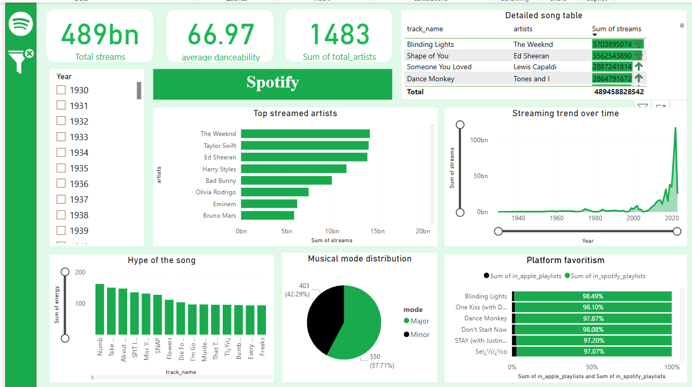

# 🎧 Spotify Listening Habits Dashboard (Power BI)

A data-driven Power BI dashboard that explores personal Spotify listening behavior. This project visualizes insights such as top artists, most played tracks, genre preferences, and time-based listening trends — all wrapped in a sleek, interactive interface.



---

## 📌 Overview

This project was created to showcase proficiency in Power BI, DAX, and data storytelling. It visualizes Spotify streaming history to understand listening patterns, favorite genres, and music consumption habits.

Whether you're a fellow data nerd or a recruiter looking for dashboarding skills, this project demonstrates practical data analysis with a pop-culture twist.

---

## 📊 Features

- 🎶 **Top Artists & Songs**  
  Displays most frequently played tracks and artists.

- 🎧 **Genre Analysis**  
  Shows distribution and dominance of music genres.

- 📆 **Listening Trends Over Time**  
  Time-series visuals revealing when the user listens to music most (daily, weekly, monthly).

- ⏱️ **Average Listening Duration**  
  Breakdown of session lengths, peak hours, and listening streaks.

- 🧩 **Interactive Filters & Slicers**  
  Filter by genre, date, or artist to get specific insights.

---

## 🧠 Key Insights Derived

- Peak listening hours during evenings and weekends.
- A strong preference for indie and lo-fi genres.
- High replay value for a select few artists and songs.
- Decline in streaming during exam season (correlation noted!).

---

## 📁 File Structure

```bash
/
├── Spotify_Dashboard.pbix          # Main Power BI project file
├── README.md                       # GitHub documentation file
├── images/
│   └── spotify-dashboard-preview.png (optional) 
└── data/
    └── (Optional CSV or Excel raw data files)
